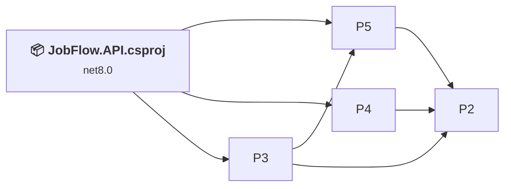
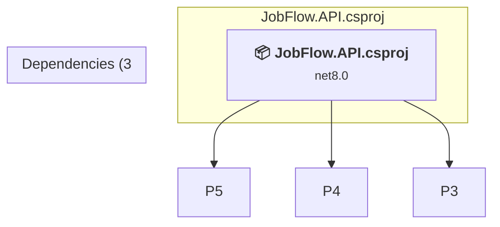

# Projects and dependencies analysis

This document provides a comprehensive overview of the projects and their dependencies in the context of upgrading to .NETCoreApp,Version=v10.0.

## Table of Contents

- [Executive Summary](#executive-Summary)
  - [Highlevel Metrics](#highlevel-metrics)
  - [Projects Compatibility](#projects-compatibility)
  - [Package Compatibility](#package-compatibility)
  - [API Compatibility](#api-compatibility)
- [Aggregate NuGet packages details](#aggregate-nuget-packages-details)
- [Top API Migration Challenges](#top-api-migration-challenges)
  - [Technologies and Features](#technologies-and-features)
  - [Most Frequent API Issues](#most-frequent-api-issues)
- [Projects Relationship Graph](#projects-relationship-graph)
- [Project Details](#project-details)

  - [%USERPROFILE%\repos\JobFlow-API\JobFlow.Business\JobFlow.Business.csproj](#%userprofile%reposjobflow-apijobflowbusinessjobflowbusinesscsproj)
  - [%USERPROFILE%\repos\JobFlow-API\JobFlow.Domain\JobFlow.Domain.csproj](#%userprofile%reposjobflow-apijobflowdomainjobflowdomaincsproj)
  - [%USERPROFILE%\repos\JobFlow-API\JobFlow.Infrastructure.Persistence\JobFlow.Infrastructure.Persistence.csproj](#%userprofile%reposjobflow-apijobflowinfrastructurepersistencejobflowinfrastructurepersistencecsproj)
  - [%USERPROFILE%\repos\JobFlow-API\JobFlow.Infrastructure\JobFlow.Infrastructure.csproj](#%userprofile%reposjobflow-apijobflowinfrastructurejobflowinfrastructurecsproj)
  - [JobFlow.API.csproj](#jobflowapicsproj)

## Executive Summary

### Highlevel Metrics

| Metric | Count | Status |
| :--- | :---: | :--- |
| Total Projects | 5 | All require upgrade |
| Total NuGet Packages | 21 | 10 need upgrade |
| Total Code Files | 289 |  |
| Total Code Files with Incidents | 9 |  |
| Total Lines of Code | 34629 |  |
| Total Number of Issues | 52 |  |
| Estimated LOC to modify | 21+ | at least 0.1% of codebase |

### Projects Compatibility

| Project | Target Framework | Difficulty | Package Issues | API Issues | Est. LOC Impact | Description |
| :--- | :---: | :---: | :---: | :---: | :---: | :--- |
| [%USERPROFILE%\repos\JobFlow-API\JobFlow.Business\JobFlow.Business.csproj](#%userprofile%reposjobflow-apijobflowbusinessjobflowbusinesscsproj) | net8.0 | 🟢 Low | 2 | 0 |  | ClassLibrary, Sdk Style = True |
| [%USERPROFILE%\repos\JobFlow-API\JobFlow.Domain\JobFlow.Domain.csproj](#%userprofile%reposjobflow-apijobflowdomainjobflowdomaincsproj) | net8.0 | 🟢 Low | 1 | 0 |  | ClassLibrary, Sdk Style = True |
| [%USERPROFILE%\repos\JobFlow-API\JobFlow.Infrastructure.Persistence\JobFlow.Infrastructure.Persistence.csproj](#%userprofile%reposjobflow-apijobflowinfrastructurepersistencejobflowinfrastructurepersistencecsproj) | net8.0 | 🟢 Low | 5 | 0 |  | ClassLibrary, Sdk Style = True |
| [%USERPROFILE%\repos\JobFlow-API\JobFlow.Infrastructure\JobFlow.Infrastructure.csproj](#%userprofile%reposjobflow-apijobflowinfrastructurejobflowinfrastructurecsproj) | net8.0 | 🟢 Low | 7 | 7 | 7+ | ClassLibrary, Sdk Style = True |
| [JobFlow.API.csproj](#jobflowapicsproj) | net8.0 | 🟢 Low | 11 | 14 | 14+ | AspNetCore, Sdk Style = True |

### Package Compatibility

| Status | Count | Percentage |
| :--- | :---: | :---: |
| ✅ Compatible | 11 | 52.4% |
| ⚠️ Incompatible | 3 | 14.3% |
| 🔄 Upgrade Recommended | 7 | 33.3% |
| ***Total NuGet Packages*** | ***21*** | ***100%*** |

### API Compatibility

| Category | Count | Impact |
| :--- | :---: | :--- |
| 🔴 Binary Incompatible | 3 | High - Require code changes |
| 🟡 Source Incompatible | 7 | Medium - Needs re-compilation and potential conflicting API error fixing |
| 🔵 Behavioral change | 11 | Low - Behavioral changes that may require testing at runtime |
| ✅ Compatible | 47364 |  |
| ***Total APIs Analyzed*** | ***47385*** |  |

## Aggregate NuGet packages details

| Package | Current Version | Suggested Version | Projects | Description |
| :--- | :---: | :---: | :--- | :--- |
| Azure.Extensions.AspNetCore.Configuration.Secrets | 1.4.0 |  | [JobFlow.API.csproj](#jobflowapicsproj) | ✅Compatible |
| Azure.Identity | 1.13.2 |  | [JobFlow.API.csproj](#jobflowapicsproj) | ⚠️NuGet package is deprecated |
| FirebaseAdmin | 3.1.0 |  | [JobFlow.API.csproj](#jobflowapicsproj) | ✅Compatible |
| FluentValidation.AspNetCore | 11.3.0 |  | [JobFlow.API.csproj](#jobflowapicsproj) | ⚠️NuGet package is deprecated |
| Google.Apis.Auth | 1.69.0 |  | [JobFlow.API.csproj](#jobflowapicsproj) | ✅Compatible |
| Hangfire | 1.8.18 |  | [JobFlow.API.csproj](#jobflowapicsproj) | ✅Compatible |
| Hangfire.AspNetCore | 1.8.18 |  | [JobFlow.API.csproj](#jobflowapicsproj) | ✅Compatible |
| Hangfire.SqlServer | 1.8.18 |  | [JobFlow.API.csproj](#jobflowapicsproj) | ✅Compatible |
| Microsoft.AspNet.WebApi.Core | 5.3.0 |  | [JobFlow.API.csproj](#jobflowapicsproj) | ⚠️NuGet package is incompatible |
| Microsoft.AspNetCore.Authentication.JwtBearer | 8.0.14 | 10.0.3 | [JobFlow.API.csproj](#jobflowapicsproj) | NuGet package upgrade is recommended |
| Microsoft.AspNetCore.Identity.EntityFrameworkCore | 8.0.14 | 10.0.3 | [JobFlow.API.csproj](#jobflowapicsproj) | NuGet package upgrade is recommended |
| Microsoft.AspNetCore.SignalR | 1.2.0 |  | [JobFlow.API.csproj](#jobflowapicsproj) | Needs to be replaced with Replace with new package Microsoft.AspNetCore.SignalR.Client=10.0.3 |
| Microsoft.EntityFrameworkCore | 9.0.2 | 10.0.3 | [JobFlow.API.csproj](#jobflowapicsproj) | NuGet package upgrade is recommended |
| Microsoft.EntityFrameworkCore.Design | 9.0.2 | 10.0.3 | [JobFlow.API.csproj](#jobflowapicsproj) | NuGet package upgrade is recommended |
| Microsoft.EntityFrameworkCore.SqlServer | 9.0.2 | 10.0.3 | [JobFlow.API.csproj](#jobflowapicsproj) | NuGet package upgrade is recommended |
| Microsoft.EntityFrameworkCore.Tools | 9.0.2 | 10.0.3 | [JobFlow.API.csproj](#jobflowapicsproj) | NuGet package upgrade is recommended |
| Square | 40.1.0 |  | [JobFlow.API.csproj](#jobflowapicsproj) | ✅Compatible |
| Stripe.net | 50.0.0 |  | [JobFlow.API.csproj](#jobflowapicsproj) | ✅Compatible |
| Swashbuckle.AspNetCore | 7.3.1 |  | [JobFlow.API.csproj](#jobflowapicsproj) | ✅Compatible |
| System.Linq.Async | 6.0.1 |  | [JobFlow.API.csproj](#jobflowapicsproj) | ✅Compatible |
| System.Text.Json | 9.0.2 | 10.0.3 | [JobFlow.API.csproj](#jobflowapicsproj) | NuGet package upgrade is recommended |

## Top API Migration Challenges

### Technologies and Features

| Technology | Issues | Percentage | Migration Path |
| :--- | :---: | :---: | :--- |

### Most Frequent API Issues

| API | Count | Percentage | Category |
| :--- | :---: | :---: | :--- |
| T:System.Uri | 4 | 19.0% | Behavioral Change |
| M:System.Uri.#ctor(System.String) | 3 | 14.3% | Behavioral Change |
| M:System.TimeSpan.FromSeconds(System.Double) | 3 | 14.3% | Source Incompatible |
| M:System.TimeSpan.FromMinutes(System.Double) | 3 | 14.3% | Source Incompatible |
| M:Microsoft.Extensions.DependencyInjection.OptionsConfigurationServiceCollectionExtensions.Configure''1(Microsoft.Extensions.DependencyInjection.IServiceCollection,Microsoft.Extensions.Configuration.IConfiguration) | 3 | 14.3% | Binary Incompatible |
| M:Microsoft.AspNetCore.Builder.ExceptionHandlerExtensions.UseExceptionHandler(Microsoft.AspNetCore.Builder.IApplicationBuilder,System.String) | 1 | 4.8% | Behavioral Change |
| M:Microsoft.Extensions.Logging.ConsoleLoggerExtensions.AddConsole(Microsoft.Extensions.Logging.ILoggingBuilder) | 1 | 4.8% | Behavioral Change |
| T:Microsoft.Extensions.Configuration.AzureKeyVaultConfigurationExtensions | 1 | 4.8% | Source Incompatible |
| T:System.Net.Http.HttpContent | 1 | 4.8% | Behavioral Change |
| M:Microsoft.Extensions.DependencyInjection.HttpClientFactoryServiceCollectionExtensions.AddHttpClient(Microsoft.Extensions.DependencyInjection.IServiceCollection,System.String,System.Action{System.IServiceProvider,System.Net.Http.HttpClient}) | 1 | 4.8% | Behavioral Change |

## Projects Relationship Graph

Legend:
📦 SDK-style project
⚙️ Classic project

## Project Details

### JobFlow.API.csproj

#### Project Info

- **Current Target Framework:** net8.0
- **Proposed Target Framework:** net10.0
- **SDK-style**: True
- **Project Kind:** AspNetCore
- **Dependencies**: 3
- **Dependants**: 0
- **Number of Files**: 42
- **Number of Files with Incidents**: 2
- **Lines of Code**: 2518
- **Estimated LOC to modify**: 14+ (at least 0.6% of the project)

#### Dependency Graph

Legend:
📦 SDK-style project
⚙️ Classic project

### API Compatibility

| Category | Count | Impact |
| :--- | :---: | :--- |
| 🔴 Binary Incompatible | 3 | High - Require code changes |
| 🟡 Source Incompatible | 5 | Medium - Needs re-compilation and potential conflicting API error fixing |
| 🔵 Behavioral change | 6 | Low - Behavioral changes that may require testing at runtime |
| ✅ Compatible | 3473 |  |
| ***Total APIs Analyzed*** | ***3487*** |  |

